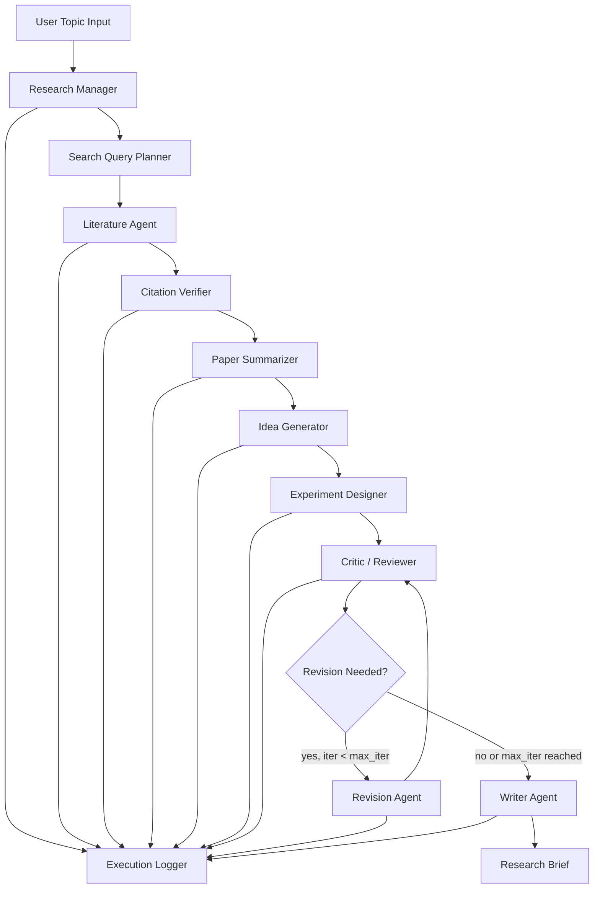

# Assignment 5 Design Document

## 1. 프로젝트 개요

본 프로그램은 사용자가 자연어로 연구 주제와 제약 조건을 입력하면 관련 논문 탐색, 논문 요약 및 비교, 연구 아이디어 생성, 실험 설계, 비판적 검토, 반복 개선, 최종 research brief 작성을 자동으로 수행하는 multi-agent research automation system이다.

과제의 핵심 요구사항은 단일 LLM 호출이 아니라 서로 다른 책임을 가진 agent들이 명확한 입력과 출력을 주고받으며 하나의 연구 workflow를 완성하는 것이다. 따라서 본 설계는 manager-worker 구조와 critic-reviser loop를 결합한다.

## 2. 설계 목표

- 최소 3개 이상의 독립 agent를 포함하고, 각 agent의 책임, 입력, 출력, 모델, tool 사용 내역을 명확히 기록한다.
- 논문 검색 결과는 제목, 저자, 연도, URL 또는 DOI를 포함한 검증 가능한 citation으로 저장한다.
- 최소 5편 이상의 논문 또는 자료를 요약하고 핵심 주장, 방법, 실험, 한계, 연구 주제와의 관련성을 비교한다.
- 최소 3개 이상의 연구 아이디어를 생성하고 novelty, feasibility, expected contribution을 분리해 평가한다.
- 하나 이상의 아이디어에 대해 dataset, baseline, metric, ablation, failure case, risk를 포함한 실험 계획을 생성한다.
- Critic/Reviewer agent의 지적을 실제 revision 단계에 반영한다.
- 무한 반복을 방지하기 위해 최대 반복 횟수, timeout, token budget, API retry 제한을 둔다.
- 모든 prompt, model setting, agent 입출력, tool call, 오류, 비용 추정을 로그로 저장한다.

## 3. 사용 시나리오

1. 사용자는 CLI에서 연구 주제를 입력한다.
2. Research Manager가 입력을 분석해 검색 키워드와 실행 계획을 만든다.
3. Literature Agent가 논문 검색 API를 호출해 후보 논문을 수집한다.
4. Citation Verifier가 수집 논문의 제목, 저자, 연도, URL 또는 DOI를 검증한다.
5. Paper Summarizer가 검증된 논문 중 상위 5편 이상을 요약하고 비교표를 만든다.
6. Idea Generator가 연구 gap을 바탕으로 3개 이상의 연구 아이디어를 만든다.
7. Experiment Designer가 가장 유망한 아이디어에 대해 실험 계획을 작성한다.
8. Critic/Reviewer가 아이디어와 실험 계획을 reviewer-style로 비판한다.
9. Research Manager 또는 Revision Agent가 critic의 지적을 반영해 개선안을 작성한다.
10. Writer Agent가 최종 research brief를 Markdown으로 생성한다.
11. Logger가 전체 실행 로그, 비용, token 사용량, 오류 및 retry 내역을 저장한다.

## 4. 전체 아키텍처



협업 방식은 순차 workflow를 기본으로 하되, 핵심 품질 관리 지점에서 critic-reviser loop를 적용한다. Literature Agent와 Citation Verifier는 외부 자료의 신뢰성을 담당하고, Critic/Reviewer와 Revision Agent는 아이디어와 실험 계획의 품질을 개선한다.

## 5. Agent 구성

| Agent | 역할 | 입력 | 출력 | 권장 모델/도구 |
|---|---|---|---|---|
| Research Manager | 전체 실행 계획 수립, agent 호출 순서 제어, stopping rule 관리 | 사용자 연구 주제, 제약 조건, 실행 config | `ResearchPlan`, 검색 키워드, 선택 아이디어, revision 결정 | 고성능 LLM, workflow graph |
| Literature Agent | arXiv, Semantic Scholar, Crossref, OpenAlex 등에서 논문 후보 수집 | 검색 키워드, 최소 논문 수, 연도 범위 | `PaperCandidate[]` | 검색 API, HTTP client, cache |
| Citation Verifier | 논문 metadata 검증, 중복 제거, 불확실 citation 표시 | `PaperCandidate[]` | `VerifiedPaper[]`, rejected list | DOI/URL 검증, metadata API |
| Paper Summarizer | 검증 논문 요약 및 비교표 생성 | `VerifiedPaper[]`, 연구 주제 | `PaperSummary[]`, related work table | 경량 LLM, PDF/text parser |
| Idea Generator | research gap 기반 아이디어 생성 | related work table, 연구 주제 | `ResearchIdea[]` 최소 3개 | 중간급 LLM |
| Experiment Designer | 선택된 아이디어의 실험 계획 작성 | `ResearchIdea`, 논문 요약 | `ExperimentPlan` | 고성능 LLM |
| Critic/Reviewer | novelty, feasibility, 실험 타당성, citation risk 비판 | 아이디어, 실험 계획, citation 목록 | `ReviewReport` | 고성능 LLM |
| Revision Agent | critic 지적사항 반영, 개선안 작성 | 기존 아이디어/실험 계획, review report | revised idea, revised experiment plan | 중간급 또는 고성능 LLM |
| Writer Agent | 최종 research brief 작성 | 전체 intermediate output | `ResearchBrief.md` | 고성능 LLM |
| Logger | 실행 순서, prompt, 응답, tool call, token/cost 기록 | 모든 agent event | JSONL 로그, 요약 리포트 | local filesystem, SQLite |

## 6. 데이터 스키마

구현 시 Pydantic 모델을 사용해 agent 간 message passing을 구조화한다. JSON 저장도 같은 필드명을 사용한다.

```python
class UserRequest(BaseModel):
    topic: str
    constraints: list[str] = []
    target_domain: str | None = None
    max_papers: int = 8
    min_verified_papers: int = 5
    max_revision_iter: int = 2

class PaperCandidate(BaseModel):
    title: str
    authors: list[str]
    year: int | None
    venue: str | None = None
    url: str | None = None
    doi: str | None = None
    source: str
    abstract: str | None = None

class VerifiedPaper(PaperCandidate):
    verification_status: Literal["verified", "partial", "unverified"]
    verification_notes: list[str] = []
    duplicate_of: str | None = None

class PaperSummary(BaseModel):
    paper_id: str
    core_claim: str
    method: str
    experiments: str
    limitations: str
    relevance_to_topic: str

class ResearchIdea(BaseModel):
    title: str
    hypothesis: str
    novelty: str
    feasibility: str
    expected_contribution: str
    related_paper_ids: list[str]

class ExperimentPlan(BaseModel):
    idea_title: str
    datasets: list[str]
    baselines: list[str]
    metrics: list[str]
    ablations: list[str]
    expected_failure_cases: list[str]
    risks: list[str]

class ReviewReport(BaseModel):
    overall_score: int
    novelty_issues: list[str]
    feasibility_issues: list[str]
    experiment_issues: list[str]
    citation_issues: list[str]
    required_revisions: list[str]

class AgentLogEvent(BaseModel):
    run_id: str
    step_index: int
    agent_name: str
    model: str
    prompt_path: str
    input_ref: str
    output_ref: str
    tool_calls: list[dict]
    token_usage: dict | None = None
    elapsed_sec: float
    error: str | None = None
```

## 7. Workflow 상세 설계

### 7.1 입력 처리

CLI는 다음 형식을 지원한다.

```bash
python -m research_agents.run \
  --topic "vision-language models for robot manipulation under distribution shift" \
  --max-papers 8 \
  --min-verified-papers 5 \
  --max-revision-iter 2 \
  --output runs/example_vlm_robotics
```

입력값은 `UserRequest`로 검증한다. 필수 topic이 비어 있으면 실행하지 않고 사용자에게 명확한 오류를 반환한다.

### 7.2 검색 및 수집

Literature Agent는 Manager가 생성한 검색 query를 기반으로 여러 출처에서 후보 논문을 가져온다.

- 1차 검색: arXiv, Semantic Scholar, OpenAlex
- 보조 검색: Crossref DOI metadata, Papers with Code
- 사용자 제공 PDF가 있으면 PDF parser를 통해 abstract와 metadata를 보강
- 동일 제목, DOI, arXiv ID 기반으로 중복 제거
- API 실패 시 exponential backoff와 source별 fallback 적용

검색 결과는 `runs/<run_id>/artifacts/paper_candidates.json`에 저장한다.

### 7.3 Citation 검증

Citation Verifier는 hallucinated citation 방지를 위한 필수 단계다.

- DOI 또는 arXiv ID가 있으면 해당 metadata endpoint로 재조회한다.
- 제목 정규화 결과가 metadata title과 크게 다르면 `partial` 또는 `unverified`로 표시한다.
- 저자, 연도, URL 중 2개 이상이 검증되면 `verified`로 표시한다.
- 검증되지 않은 논문은 최종 참고문헌에 넣지 않고 별도 rejected list에 기록한다.
- 최소 5편의 verified 또는 partial paper가 확보되지 않으면 검색 query를 1회 확장한다.

### 7.4 논문 요약 및 비교

Paper Summarizer는 검증된 논문을 대상으로 다음 항목을 추출한다.

- 핵심 주장
- 사용한 방법
- 실험 설정
- 주요 결과
- 한계
- 입력 연구 주제와의 관련성

요약 결과는 Markdown 비교표와 JSON 파일을 모두 생성한다. PDF parsing이 실패한 경우 abstract 기반 요약임을 로그에 명시한다.

### 7.5 아이디어 생성

Idea Generator는 related work table에서 발견된 gap을 바탕으로 최소 3개 이상의 아이디어를 만든다. 각 아이디어는 다음 기준을 포함한다.

- novelty: 기존 논문과 무엇이 다른가
- feasibility: 현재 dataset, model, compute 조건에서 가능한가
- expected contribution: 논문 또는 프로젝트 결과물로 어떤 기여가 가능한가
- evidence: 어떤 기존 논문과 연결되는가

Manager는 novelty와 feasibility 점수를 기준으로 실험 설계 대상 아이디어를 1개 이상 선택한다.

### 7.6 실험 설계

Experiment Designer는 선택된 아이디어마다 다음 항목을 포함한 실험 계획을 만든다.

- dataset: 사용 가능한 공개 dataset 또는 synthetic benchmark
- baseline: 비교해야 할 기존 방법
- metric: 정량 평가 지표
- ablation: 구성 요소별 제거 실험
- expected failure case: 실패 가능성이 높은 조건
- risk: 데이터, 구현, 계산 비용, 평가 타당성 측면의 위험

### 7.7 Critic 및 Revision loop

Critic/Reviewer는 다음 관점에서 reviewer-style critique를 작성한다.

- novelty가 기존 연구와 충분히 구분되는가
- 실험 계획이 주장 검증에 충분한가
- baseline과 metric이 적절한가
- citation이 실제 논문에 근거하는가
- 과장된 주장 또는 검증 불가능한 표현이 있는가

Revision Agent는 `required_revisions`를 checklist로 사용해 아이디어와 실험 계획을 수정한다. 반복 조건은 다음과 같다.

- `max_revision_iter = 2`
- Critic의 `overall_score >= 4`이면 조기 종료
- 두 번의 revision 후에도 score가 낮으면 최종 brief의 limitation에 남은 위험을 명시

### 7.8 최종 산출물 생성

Writer Agent는 다음 구조의 `research_brief.md`를 작성한다.

```markdown
# Research Brief

## Background
## Related Work
## Research Gap
## Proposed Idea
## Experiment Plan
## Reviewer Critique and Revisions
## Limitations
## References
```

참고문헌은 `VerifiedPaper`에 기반한 citation만 포함한다. 검증 상태가 `partial`인 경우 본문 또는 참고문헌에 `partially verified`를 표시한다.

## 8. 프로젝트 구조

```text
assignment5/
  docs/
    assignment5.md
    design.md
  research_agents/
    __init__.py
    run.py
    config.py
    schemas.py
    workflow.py
    agents/
      manager.py
      literature.py
      verifier.py
      summarizer.py
      idea_generator.py
      experiment_designer.py
      critic.py
      reviser.py
      writer.py
    tools/
      search_arxiv.py
      search_openalex.py
      search_semantic_scholar.py
      pdf_parser.py
      cache.py
      cost_tracker.py
    prompts/
      manager.md
      literature.md
      summarizer.md
      idea_generator.md
      experiment_designer.md
      critic.md
      reviser.md
      writer.md
  runs/
    <run_id>/
      config.json
      logs/
        agent_events.jsonl
        errors.jsonl
        cost_summary.json
      artifacts/
        paper_candidates.json
        verified_papers.json
        paper_summaries.json
        ideas.json
        experiment_plan.json
        review_report.json
        revised_plan.json
      outputs/
        research_brief.md
        related_work_table.md
        execution_report.md
```

## 9. 로그 및 재현성 설계

모든 실행은 고유 `run_id`를 갖는다. `run_id`는 실행 시작 시각과 topic hash로 만든다.

저장 항목:

- 사용자 입력 및 실행 config
- agent 실행 순서
- 각 agent prompt 파일 경로와 prompt version
- agent 입력 JSON과 출력 JSON
- tool call 종류, query, 응답 상태, retry 횟수
- 사용 모델, temperature, max tokens
- token 사용량, 추정 비용, 실행 시간
- citation verification 결과
- critic 지적사항과 revision 반영 여부
- 오류, fallback, parsing failure

로그는 사람이 읽기 쉬운 Markdown 요약과 기계적으로 재실행 가능한 JSONL을 모두 남긴다.

## 10. 비용 및 성능 제어

- Manager, Critic, Writer에는 고성능 모델을 사용한다.
- Literature metadata 정리, 요약 초안, 형식 변환에는 경량 모델을 사용한다.
- 동일 검색 query와 DOI metadata는 SQLite cache에 저장한다.
- source별 API rate limit을 설정한다.
- LLM 호출에는 timeout과 retry 제한을 둔다.
- paper 수, revision 수, max tokens를 CLI 인자로 제한한다.
- 실행 종료 후 `cost_summary.json`에 agent별 token 사용량, 실행 시간, 비용 추정을 저장한다.

예상 기본 설정:

| 항목 | 기본값 |
|---|---:|
| 검색 후보 논문 수 | 12 |
| 최소 검증 논문 수 | 5 |
| 요약 대상 논문 수 | 5-8 |
| 생성 아이디어 수 | 3 |
| revision 최대 반복 | 2 |
| API retry | 3 |
| LLM timeout | 60초 |

## 11. 오류 처리

| 오류 상황 | 처리 방식 |
|---|---|
| 검색 API rate limit | backoff 후 재시도, 다른 source로 fallback |
| metadata 불일치 | `partial` 또는 `unverified`로 표시하고 최종 참고문헌 제외 |
| PDF parsing 실패 | abstract 기반 요약으로 degrade, 로그에 원인 기록 |
| 검증 논문 5편 미만 | query 확장 후 1회 재검색 |
| LLM JSON 파싱 실패 | schema repair prompt 1회 수행, 실패 시 raw output 보관 |
| Critic loop 반복 위험 | `max_revision_iter`로 강제 종료 |
| 비용 초과 위험 | remaining budget 확인 후 요약 대상 논문 수 축소 |

## 12. 테스트 계획

### 12.1 단위 테스트

- `UserRequest`와 agent output schema validation
- DOI/arXiv ID 기반 중복 제거
- citation verification status 판정
- JSONL logger append 및 재로드
- cost tracker 계산

### 12.2 통합 테스트

- 예시 topic 1개에 대해 end-to-end workflow 실행
- 검색 API 하나가 실패해도 fallback으로 계속 진행되는지 확인
- 최소 5편 이상 논문 요약이 생성되는지 확인
- 최소 3개 이상 아이디어가 생성되는지 확인
- Critic report의 `required_revisions`가 revised plan에 반영되는지 확인
- 최종 `research_brief.md`가 필수 섹션과 References를 포함하는지 확인

### 12.3 품질 검증

- 최종 참고문헌의 URL 또는 DOI가 실제 metadata와 일치하는지 확인
- related work table에 핵심 주장, 방법, 실험, 한계, 관련성이 모두 있는지 확인
- experiment plan에 dataset, baseline, metric, ablation, failure case, risk가 모두 있는지 확인
- critic이 구체적인 약점과 개선안을 제시하는지 확인
- 동일 topic 재실행 시 핵심 논문과 주요 결론이 지나치게 흔들리지 않는지 확인

## 13. 과제 요구사항 대응표

| 요구사항 | 설계 반영 |
|---|---|
| 연구 주제 입력 | CLI `--topic` 및 `UserRequest` schema |
| Agent 역할 분리 | Manager, Literature, Verifier, Summarizer, Idea Generator, Experiment Designer, Critic, Reviser, Writer |
| 논문/자료 탐색 | arXiv, Semantic Scholar, OpenAlex, Crossref, PDF parser |
| 논문 요약 및 비교 | `PaperSummary[]`, related work table, 최소 5편 |
| 아이디어 생성 | `ResearchIdea[]`, 최소 3개 |
| 실험 설계 | `ExperimentPlan`에 dataset, baseline, metric, ablation, failure case, risk 포함 |
| Critic/Reviewer 단계 | Critic/Reviewer agent와 `ReviewReport` |
| 반복 개선 루프 | Revision Agent, `max_revision_iter`, score 기반 stopping rule |
| 최종 산출물 | `research_brief.md` |
| 실행 로그 저장 | `agent_events.jsonl`, `cost_summary.json`, artifacts 저장 |
| 사용자 인터페이스 | CLI 기본 제공 |
| 비용/성능 분석 | cost tracker, token usage, elapsed time, model-role 분리 |
| workflow graph | 본 문서의 Mermaid diagram |
| citation hallucination 방지 | Citation Verifier, unverified 제외 정책 |

## 14. 구현 우선순위

1. Pydantic schema, logger, CLI skeleton 구현
2. Literature Agent와 Citation Verifier 구현
3. Summarizer, Idea Generator, Experiment Designer 구현
4. Critic/Reviewer와 Revision loop 구현
5. Writer Agent와 최종 Markdown 출력 구현
6. SQLite cache, cost tracker, retry/backoff 구현
7. end-to-end 테스트와 failure case 기록
8. 제출용 실행 방법 문서, 예시 실행 결과, PPT 자료 정리

## 15. 제출물 구성 계획

- 실행 가능한 소스코드: `assignment5/research_agents/`
- 실행 방법 설명서: `assignment5/docs/README.md`
- 설계 문서: `assignment5/docs/design.md`
- Workflow graph: 본 문서의 Mermaid diagram
- Prompt log: `runs/<run_id>/logs/agent_events.jsonl`
- Agent interaction log: `runs/<run_id>/logs/agent_events.jsonl`
- 최종 research brief: `runs/<run_id>/outputs/research_brief.md`
- 비용/성능 분석: `runs/<run_id>/logs/cost_summary.json`, `execution_report.md`
- Citation verification 결과: `runs/<run_id>/artifacts/verified_papers.json`
- 데모 및 발표자료: 최종 실행 결과 기반 PPT 또는 live demo
