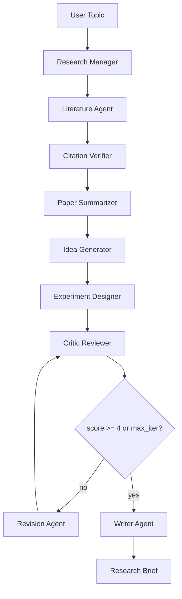

# Assignment 5 Report

## 1. 목표

본 과제는 연구 주제를 입력하면 논문 탐색, citation 검증, 논문 요약, 연구 아이디어 생성, 실험 설계, critic review, revision, 최종 research brief 작성을 수행하는 multi-agent research automation system을 구현하는 것이다.

최종 실험은 실제 Hugging Face Open Source LLM weight인 `Qwen/Qwen3-4B-Instruct-2507`을 로드하여 GPU 2, 3에서 실행했다. 유료 API는 사용하지 않았다.

## 2. 실제 실행 환경

- Repository: `/dataset/hoeun/stcv`
- Conda 환경: `/dataset/hoeun/stcv/.conda/envs/stcv_hoeun`
- Conda package cache: `/dataset/hoeun/stcv/.conda/pkgs`
- pip cache: `/dataset/hoeun/stcv/.pip_cache`
- Hugging Face cache: `/dataset/hoeun/stcv/.hf_cache`
- Torch: `2.5.1+cu121`
- GPU 제한: `CUDA_VISIBLE_DEVICES=2,3`
- 확인 결과: visible CUDA device count `2`, device name `NVIDIA H100 80GB HBM3`

모델 라우팅:

| 역할 | 실제 로드 모델 |
|---|---|
| Manager | `Qwen/Qwen3-4B-Instruct-2507` |
| Summarizer | `Qwen/Qwen3-4B-Instruct-2507` |
| Idea Generator | `Qwen/Qwen3-4B-Instruct-2507` |
| Experiment Designer | `Qwen/Qwen3-4B-Instruct-2507` |
| Critic / Reviewer | `Qwen/Qwen3-4B-Instruct-2507` |
| Revision Agent | `Qwen/Qwen3-4B-Instruct-2507` |
| Writer | `Qwen/Qwen3-4B-Instruct-2507` |

Literature search와 citation verification은 LLM generation이 아니라 API/metadata/schema 기반 tool 단계로 구현했다.

## 3. 구현 구조

```text
assignment5/
  research_agents/
    run.py
    workflow.py
    schemas.py
    config.py
    agents/
      manager.py
      literature.py
      verifier.py
      summarizer.py
      idea_generator.py
      experiment_designer.py
      critic.py
      reviser.py
      writer.py
    tools/
      cache.py
      cost_tracker.py
      logger.py
      llm.py
      search_arxiv.py
      search_openalex.py
      search_semantic_scholar.py
      search_offline.py
    prompts/
      *.md
  runs/
    qwen3_vlm_robotics_actual/
  tests/
    test_workflow.py
```

## 4. Workflow



협업 방식은 manager-worker 구조와 critic-reviser loop를 결합했다. Critic 점수가 4 이상이면 조기 종료하고, 그렇지 않으면 `max_revision_iter`까지 Revision Agent가 개선안을 반영한다.

## 5. 실제 실행 명령

```bash
cd /dataset/hoeun/stcv
CUDA_VISIBLE_DEVICES=2,3 \
HF_HOME=/dataset/hoeun/stcv/.hf_cache \
HF_HUB_CACHE=/dataset/hoeun/stcv/.hf_cache/hub \
HUGGINGFACE_HUB_CACHE=/dataset/hoeun/stcv/.hf_cache/hub \
TRANSFORMERS_CACHE=/dataset/hoeun/stcv/.hf_cache/hub \
HF_DATASETS_CACHE=/dataset/hoeun/stcv/.hf_cache/datasets \
XDG_CACHE_HOME=/dataset/hoeun/stcv/.cache \
TMPDIR=/dataset/hoeun/stcv/.tmp \
PIP_CACHE_DIR=/dataset/hoeun/stcv/.pip_cache \
CONDA_ENVS_PATH=/dataset/hoeun/stcv/.conda/envs \
CONDA_PKGS_DIRS=/dataset/hoeun/stcv/.conda/pkgs \
conda run -n stcv_hoeun \
  python -m assignment5.research_agents.run \
  --topic "vision-language models for robot manipulation under distribution shift" \
  --max-papers 8 \
  --min-verified-papers 5 \
  --max-revision-iter 2 \
  --use-local-llm \
  --output assignment5/runs/qwen3_vlm_robotics_actual
```

## 6. 실제 실행 결과

최종 run directory:

- `assignment5/runs/qwen3_vlm_robotics_actual/`

주요 산출물:

- `outputs/research_brief.md`
- `outputs/execution_report.md`
- `outputs/related_work_table.md`
- `logs/agent_events.jsonl`
- `logs/cost_summary.json`
- `artifacts/verified_papers.json`
- `artifacts/rejected_papers.json`
- `artifacts/llm/*.json`

실제 LLM generation artifact:

| Agent | Raw output |
|---|---|
| Research Manager | `artifacts/llm/manager_plan_raw.json` |
| Paper Summarizer | `artifacts/llm/summarizer_related_work_raw.json` |
| Idea Generator | `artifacts/llm/idea_generator_raw.json` |
| Experiment Designer | `artifacts/llm/experiment_designer_raw.json` |
| Critic Iteration 0 | `artifacts/llm/critic_iter_0_raw.json` |
| Revision Agent | `artifacts/llm/reviser_iter_0_raw.json` |
| Critic Iteration 1 | `artifacts/llm/critic_iter_1_raw.json` |
| Writer | `artifacts/llm/writer_research_brief_raw.json` |

`logs/errors.jsonl`은 비어 있다.

## 7. Agent별 책임과 출력

| Agent | 입력 | 출력 | 주요 책임 |
|---|---|---|---|
| Research Manager | `UserRequest` | `ResearchPlan` + Qwen raw plan | 검색 query, workflow, stopping rule 생성 |
| Literature Agent | `ResearchPlan` | `PaperCandidate[]` | arXiv/OpenAlex/Semantic Scholar/offline seed 검색 |
| Citation Verifier | `PaperCandidate[]` | `VerifiedPaper[]` | 중복 제거, verified/partial/unverified 판정 |
| Paper Summarizer | `VerifiedPaper[]` | `PaperSummary[]` + Qwen raw summary | 핵심 주장, 방법, 실험, 한계 비교 |
| Idea Generator | summaries | `ResearchIdea[]` + Qwen raw ideas | 최소 3개 연구 아이디어 생성 |
| Experiment Designer | selected idea | `ExperimentPlan` + Qwen raw plan | dataset, baseline, metric, ablation, risk 설계 |
| Critic Reviewer | idea, plan, papers | `ReviewReport` + Qwen raw critique | novelty, feasibility, experiment, citation 위험 평가 |
| Revision Agent | review, idea, plan | `RevisedPlan` + Qwen raw revision | critic 지적 반영 |
| Writer Agent | 전체 artifact | `research_brief.md` + Qwen raw brief | 최종 research brief 작성 |

구조화된 JSON은 Pydantic schema로 검증했다. Qwen raw output은 그대로 보관하고, 최종 제출용 Markdown에는 citation verifier를 통과한 reference만 포함했다.

## 8. Citation 검증

Demo topic:

```text
vision-language models for robot manipulation under distribution shift
```

최종 brief에는 verified citation 5편만 포함했다.

| No. | Paper | Year | Status |
|---:|---|---:|---|
| 1 | RT-2: Vision-Language-Action Models Transfer Web Knowledge to Robotic Control | 2023 | verified |
| 2 | Do As I Can, Not As I Say: Grounding Language in Robotic Affordances | 2022 | verified |
| 3 | PaLM-E: An Embodied Multimodal Language Model | 2023 | verified |
| 4 | VIMA: General Robot Manipulation with Multimodal Prompts | 2022 | verified |
| 5 | Perceiver-Actor: A Multi-Task Transformer for Robotic Manipulation | 2022 | verified |

검증 결과 파일:

- `assignment5/runs/qwen3_vlm_robotics_actual/artifacts/verified_papers.json`
- `assignment5/runs/qwen3_vlm_robotics_actual/artifacts/rejected_papers.json`

## 9. Critic 및 Revision 결과

Critic loop는 2회 실행되었다.

| Iteration | Score | 핵심 지적 |
|---:|---:|---|
| 0 | 3/5 | real robot validation 비용 위험, offline-first path 필요, baseline-citation mapping 필요 |
| 1 | 4/5 | offline-first revision 반영 후 조기 종료 |

Revision Agent가 반영한 내용:

- offline dataset replay 및 simulator stress test를 먼저 수행하는 검증 경로 추가
- SayCan/RT-2/Octo baseline mapping 명시
- 남은 위험을 limitation/risk section에 유지

## 10. 비용 및 성능 분석

`assignment5/runs/qwen3_vlm_robotics_actual/logs/cost_summary.json` 기준:

- paid API cost: `$0.00`
- estimated prompt tokens: `330`
- estimated completion tokens: `5147`
- measured workflow time inside agents: `156.03 sec`
- LLM artifact count: `8`

실제 외부 유료 API 호출은 없다. 모델 weight는 Hugging Face Hub에서 repository-local cache로 다운로드했고, 이후 로컬 GPU inference로 실행했다.

## 11. 실제 GPU/모델 로딩 증빙

실행 전 확인:

```text
CUDA_VISIBLE_DEVICES=2,3
torch 2.5.1+cu121
torch.cuda.is_available() = True
torch.cuda.device_count() = 2
visible devices = ['NVIDIA H100 80GB HBM3', 'NVIDIA H100 80GB HBM3']
```

Qwen model loading test:

```text
model Qwen/Qwen3-4B-Instruct-2507
used True
device {'model.embed_tokens': 0, ..., 'model.layers.16': 1, ..., 'model.norm': 1}
text The local Qwen model has been successfully loaded for Assignment 5.
```

최종 run의 `agent_events.jsonl`에도 모든 generative agent의 `tool_calls`에 `transformers.generate`, `used_transformers: true`, model id, device map, raw output artifact path가 기록되어 있다.

## 12. 테스트

실행 명령:

```bash
cd /dataset/hoeun/stcv
PIP_CACHE_DIR=/dataset/hoeun/stcv/.pip_cache \
HF_HOME=/dataset/hoeun/stcv/.hf_cache \
HF_HUB_CACHE=/dataset/hoeun/stcv/.hf_cache/hub \
TRANSFORMERS_CACHE=/dataset/hoeun/stcv/.hf_cache/hub \
HF_DATASETS_CACHE=/dataset/hoeun/stcv/.hf_cache/datasets \
CONDA_ENVS_PATH=/dataset/hoeun/stcv/.conda/envs \
CONDA_PKGS_DIRS=/dataset/hoeun/stcv/.conda/pkgs \
CUDA_VISIBLE_DEVICES=2,3 \
conda run -n stcv_hoeun pytest assignment5/tests -q
```

검증 항목:

- 빈 topic validation
- offline end-to-end workflow smoke test
- verified references 5편 이상
- final brief 필수 section 포함
- critic revision 반영 여부
- agent log 및 cost summary 생성 여부

테스트 결과:

```text
2 passed in 0.27s
```

## 13. 오류 처리 및 재현성

구현된 fallback과 guard:

- network search 실패 시 curated offline seed catalog 사용
- duplicate paper 제거
- metadata가 부족한 citation은 `partial` 또는 `unverified`로 분리
- unverified citation은 최종 references에서 제외
- critic loop는 `max_revision_iter`로 제한
- prompt path, model, input/output artifact, tool call, token estimate, elapsed time을 JSONL로 기록
- Qwen raw generation과 schema-controlled artifact를 모두 보관

Agent interaction log:

```text
1 Research Manager -> artifacts/research_plan.json + artifacts/llm/manager_plan_raw.json
2 Literature Agent -> artifacts/paper_candidates.json
3 Citation Verifier -> artifacts/verified_papers.json
4 Paper Summarizer -> artifacts/paper_summaries.json + artifacts/llm/summarizer_related_work_raw.json
5 Idea Generator -> artifacts/ideas.json + artifacts/llm/idea_generator_raw.json
6 Experiment Designer -> artifacts/experiment_plan.json + artifacts/llm/experiment_designer_raw.json
7 Critic Reviewer -> artifacts/review_report_iter_0.json + artifacts/llm/critic_iter_0_raw.json
8 Revision Agent -> artifacts/revised_plan_iter_0.json + artifacts/llm/reviser_iter_0_raw.json
9 Critic Reviewer -> artifacts/review_report_iter_1.json + artifacts/llm/critic_iter_1_raw.json
10 Writer Agent -> outputs/research_brief.md + artifacts/llm/writer_research_brief_raw.json
```

전체 로그는 `assignment5/runs/qwen3_vlm_robotics_actual/logs/agent_events.jsonl`에 있다.

## 14. 요구사항 대응표

| 요구사항 | 구현 상태 |
|---|---|
| 연구 주제 입력 | CLI `--topic` |
| 3개 이상 agent | 9개 agent 구현 |
| 논문/자료 탐색 | arXiv/OpenAlex/Semantic Scholar/offline seed |
| 논문 요약 및 비교 | 5편 이상 summary 및 related work table |
| 실제 Open Source LLM 사용 | `Qwen/Qwen3-4B-Instruct-2507` weight 로드 및 GPU generation |
| 아이디어 생성 | 3개 idea 생성 + Qwen raw output 저장 |
| 실험 설계 | dataset, baseline, metric, ablation, failure case, risk 포함 |
| Critic/Reviewer | `CriticReviewer` 구현 + Qwen raw critique 저장 |
| 반복 개선 루프 | critic score와 `max_revision_iter` 기반 revision |
| 최종 산출물 | `research_brief.md` |
| 실행 로그 저장 | JSONL, JSON artifacts, cost summary, LLM raw outputs |
| 사용자 인터페이스 | CLI |
| 비용/성능 분석 | `cost_summary.json`, `execution_report.md` |
| workflow graph | 본 보고서 및 `design.md` |
| citation hallucination 방지 | `CitationVerifier`, rejected list |

## 15. 한계

- 최종 실험은 Qwen3 계열 모델 하나로 통일했다. Gemma 4는 별도로 실행하지 않았다.
- Abstract/metadata 기반 요약은 full PDF reading보다 정보가 제한적이다.
- Search API rate limit이 발생할 수 있어 offline seed fallback을 유지했다.
- 실제 로봇 실험은 hardware availability와 안전 검증이 필요하므로 본 과제에서는 offline-first experiment plan으로 제한했다.
